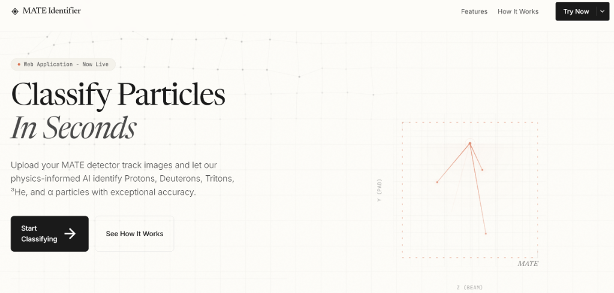
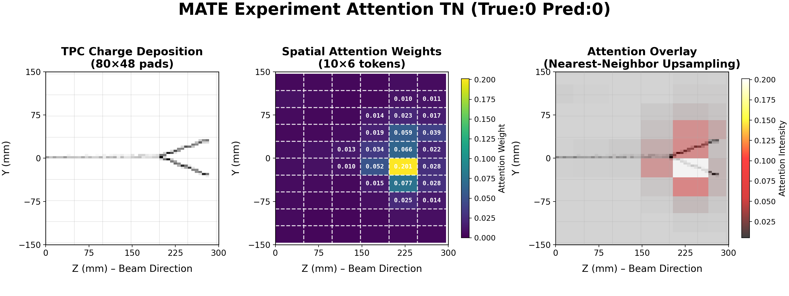
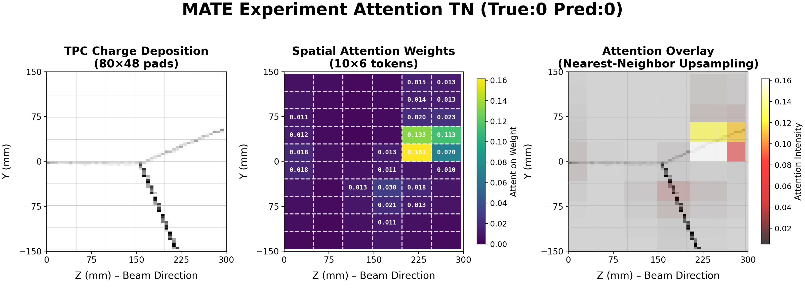
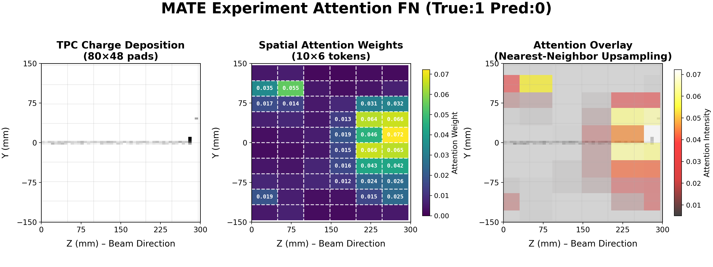
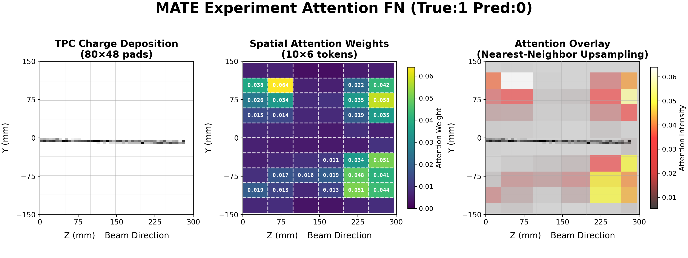
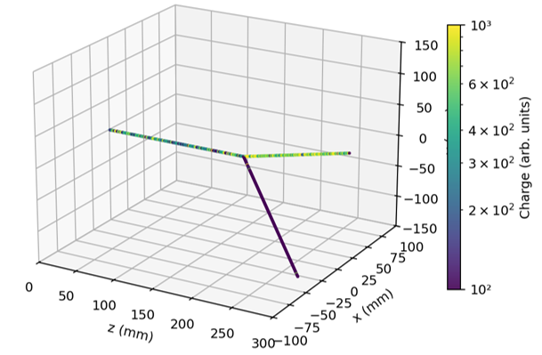
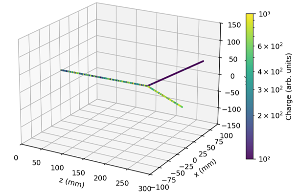

# MATE-Event-Classifier-DL

> **A Physics-Informed Deep Learning Framework for Automated Particle Identification in Time Projection Chambers**

[](https://www.python.org/downloads/)
[](https://pytorch.org/)
[](https://opensource.org/licenses/MIT)

---

## Overview

MATE-Event-Classifier-DL is a deep learning framework designed for the **MATE (Multi-purpose Active-target Time projection chamber for nuclear astrophysical and Exotic beam experiments)** at the Institute of Modern Physics, CAS.

This project addresses the challenge of **automated particle identification** in medium/low-energy nuclear physics experiments. Rather than treating the detector as a black-box image source, we employ a **Physics-Informed approach** that explicitly integrates domain knowledge (Moment of Inertia Tensors) into the model architecture.

**Key Philosophy:** *Interpretability and reliability over raw accuracy.* The system is designed so domain experts can audit model decisions.

---

## Key Features

### ⚛️ Physics-Informed Architecture
- Explicit injection of **physical state vectors** (Moment of Inertia Tensor: I_xx, I_yy, I_xy = I_yx ; Total Charge Deposition) into the model via a **Physics Token**
- A compact hybrid CNN+Transformer design: a modified ResNet-18 extracts spatial features, which are fused with the physics token in a Transformer encoder
- Real attention weights can be extracted for auditing what the physics token attends to in the image tokens

### 🔍 Real Attention-Based XAI (Explainable AI)
- Transparent decision-making via **real attention weight extraction** (not synthetic visualizations)
- Spatial attention heatmaps enable physicists to verify model focus
- Systematic **error analysis pipelines** to characterize failure modes

### 🧠 Hybrid CNN-Transformer Architecture 
This repository contains a compact, reproducible baseline implemented in:
- `models/model.py` (modified ResNet-18 backbone + Transformer encoder + Physics Token)
- `train.py` / `evaluate.py` (training + evaluation + attention visualization)

### 💻 Simulation-Based Training (Sim-to-Real Pipeline)
- Trained on high-fidelity **Geant4-based Monte Carlo simulations** (MATESIM)
- Addresses labeled data scarcity in nuclear physics
- Domain adaptation for real experimental data is under active development

---

## Visual Deployment

The project includes an interactive **web-based demo interface** that allows users to:
- Upload HDF5 or ROOT files for classification
- Try pre-loaded sample data (Proton, Alpha, Mixed)
- View classification results with confidence scores
- Download results in CSV or JSON format



*The MATE Identifier web interface with an Anthropic-inspired design.*

### Deploying the Frontend Locally

The landing page is a static HTML/CSS/JS application with no build step required.

#### Option 1: Python HTTP Server (Recommended)

```bash
# Navigate to the landing page directory
cd landing_page

# Start a local HTTP server
python -m http.server 8080

# Open in your browser
# → http://localhost:8080
```

#### Option 2: VS Code Live Server

1. Install the **Live Server** extension in VS Code
2. Open the `landing_page/` folder
3. Right-click `index.html` → **Open with Live Server**

#### Option 3: Direct File Open

Simply double-click `landing_page/index.html` to open it directly in your browser. Note: Some features (like file uploads) may be restricted due to browser security policies when using the `file://` protocol.

### Frontend Structure

```
landing_page/
├── index.html    # Main HTML structure
├── styles.css    # Anthropic-inspired theme styling
└── script.js     # Interactive functionality (upload, demo, etc.)
```

### Features

| Feature | Description |
|---------|-------------|
| **File Upload** | Drag-and-drop or click to upload HDF5/ROOT files |
| **Sample Data** | Quick demo with pre-configured Proton, Alpha, or Mixed samples |
| **Results Table** | View predictions with confidence scores for each file |
| **Export** | Download classification results as CSV or JSON |
| **Responsive Design** | Works on desktop and mobile browsers |

> **Note:** The web demo currently simulates classification results for demonstration purposes. To connect it to the actual PyTorch model, you would need to implement a backend API (e.g., Flask/FastAPI) that loads the trained model and processes uploaded files.

---

## Architecture


*Physics-informed hybrid architecture combining CNN/ViT backbones with cross-attention mechanism.*

---

## Attention Visualization

**Well-Trained Model:**




*The model correctly focuses on the particle track region with high energy deposition and specific physics features(e.g. Bragg Peak).*

**Distracted Model:**




*A poorly-trained model shows scattered, unfocused attention across irrelevant regions.*

## Data Format

| Property | Value |
|----------|-------|
| **Image Shape** | `(80, 48, 2)` → `(N, 2, 80, 48)` for PyTorch |
| **Projection Plane** | Y-Z plane (beam along Z-axis) |
| **Channel 0** | Charge Deposition (energy) |
| **Channel 1** | Drift Time Proxy (X-coordinate) |
| **Detector Dimensions** | Y: [-150, 150] mm, Z: [0, 300] mm, X: [-100, 100] mm |

---

## Performance & Reliability

The framework supports multiple classification tasks:

| Task | Classes | Best Accuracy |
|------|---------|---------------|
| Binary (³He vs ⁴He) | 2 | ~95%+ |
| Binary (¹²C vs ¹³C) | 2 | ~92%+ |
| Proton-Deuteron-Triton | 3 | ~95%+ |
| 5-Class (p, d, t, ³He, α) | 5 | ~95%+ |

<p float="left">
  
   
</p>

*Visualization of typical ³He (left) and ⁴He (right) particle tracks in the MATE.*


*Comparison of model accuracy with and without Physics-Informed constraints in 3He Vs 4He task.*


---

## Installation

```bash
# Clone the repository
git clone https://github.com/Edfghdrtxxx/MATE-Event-Classifier-DL.git
cd MATE-Event-Classifier-DL

# Create virtual environment (recommended)
python -m venv venv
source venv/bin/activate  # On Windows: venv\Scripts\activate

# Install dependencies
pip install -r requirements.txt
```

---

## Quick Start

### 1. Prepare Data (HDF5)
Place your HDF5 files under `dataset/HDF5_Form/` (or set `data.data_dir` in `configs/config.yaml`).

Expected keys per file:
- `images`: `(N, H, W, 2)` (default MATE Y-Z projection is `(80, 48, 2)`)
- `physics_features`: `(N, 4)` moment-of-inertia features

### 2. Train (binary by default)
```bash
python train.py --epochs 50 --batch_size 64
```

### 3. Evaluate (optionally generate attention maps)
```bash
python evaluate.py --checkpoint outputs/best_model.pth
```

### 4. Smoke test / installation check (no dataset needed)
```bash
python verify.py
python demo.py
```

---

## Project Structure

```
MATE-Event-Classifier-DL/
├── configs/
│   └── config.yaml           # Default configuration (binary by default)
├── data/
│   └── dataloader.py         # HDF5 dataset + stratified train/val/test split
├── landing_page/
│   ├── index.html            # Web demo frontend
│   ├── styles.css            # Anthropic-inspired styling
│   └── script.js             # Interactive functionality
├── models/
│   └── model.py              # modified ResNet-18 + Transformer + Physics Token
├── utils/
│   └── utils.py              # Metrics + confusion matrix + attention visualization
├── train.py                  # Training entrypoint
├── evaluate.py               # Evaluation entrypoint
├── demo.py                   # Quick demo (no dataset required)
├── verify.py                 # Quick verification tests
└── requirements.txt
```

---

## Model Architecture Details

### Physics Features (Moment of Inertia Tensor)
```
I_xx : Second moment about X-axis
I_yy : Second moment about Y-axis  
I_xy : Cross-correlation term
Eigen_Ratio : λ_max / λ_min (elongation measure)
```

These features encode the **geometric shape** of particle tracks, providing physics-based priors that guide attention.

---

## Interpretation 
This repository exposes **real attention weights** from the final Transformer layer (see `models/model.py` and `utils/utils.py`). In the default visualization we plot **what the Physics Token attends to** over the spatial tokens.

Important caveats:
- Attention is **not guaranteed causal attribution**. It is an audit signal, not a proof of “why” the network predicted a class.
- Always compare **correct vs wrong** samples: a “good-looking” attention map on correct samples can still be misleading.
- Minimal sanity checks (recommended):
  - **Perturbation**: mask/zero out the most-attended regions and check prediction stability.
  - **Counterfactual**: shuffle physics features across the batch and quantify performance drop.

### Training Configuration (Default)
| Parameter | Value |
|-----------|-------|
| Optimizer | AdamW (lr=1e-4, weight_decay=1e-4) |
| Scheduler | (Warm up)CosineAnnealingLR / (Warm up)ReduceLROnPlateau |
| Loss | CrossEntropyLoss (with optional class weights) |
| Data Split | 80% train, 20% validation |
| Batch Size | 64 |

---

## Roadmap & Future Work

- [x] **Phase 1:** Physics-Informed Architecture Design(Cross-Attention and Gated Fusion) & Simulation Training
- [x] **Phase 2:** Comparison of standard, Cross-Attention and Gated Gusion CNN
- [x] **Phase 3:** Multi-class classification (5-class, Multiple Reaction Channels)
- [x] **Phase 4:** Attention-based XAI visualization pipeline
- [ ] **Phase 5:** Sim-to-Real Domain Adaptation (UDA:DANN/MCD) — *In Progress*
- [ ] **Phase 6:** Deployment for real MATE experimental data
- [ ] **Phase 7:** Excitation spectrum reconstruction

---

## Citation

If you use this code in your research, please cite:

```bibtex
@software{hu2024mate,
  author = {Hu, Zhiheng},
  title = {MATE-Event-Classifier-DL: Physics-Informed Deep Learning for TPC Particle Identification},
  year = {2025},
  url = {https://github.com/Edfghdrtxxx/MATE-Event-Classifier-DL}
}
```

---

## License

This project is licensed under the MIT License - see the [LICENSE](LICENSE) file for details.

---

## Acknowledgments

- **Institute of Modern Physics, CAS** for MATE detector data and MATESIM simulation framework
- **RIKEN** for collaborative research opportunities
- The PyTorch and `timm` communities for excellent deep learning tools


